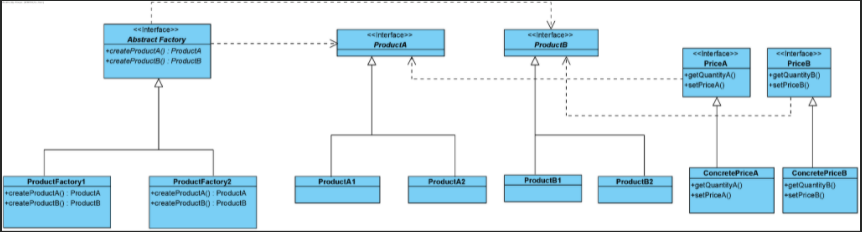
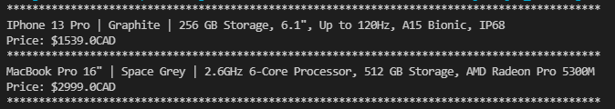

# assignment1-DesignPattern

## Abstract Factory Pattern 
The Abstract Factory pattern provides a way to encapsulate a group of individual factories that have a common theme without specifying their concrete classes. Simple put, clients use the particular product methods in the abstract class to create different objects of the product.  

## Factory Method Pattern 
The Factory Method pattern creates objects without specifying the exact class to create. The Factory Method design pattern solves problems like:
* How can an object be created so that subclasses can redefine which class to instantiate?
* How can a class defer instantiation to subclasses?

## Use Case Scenario
We would like to use an Abstract Factory to create products for inventory and at the same time set the price of the product. The price of the product is set after the product is created and is read from a database (in this assignment that database can be file of product names and prices.). For setting the price of the product one can use a Factory Method pattern. 

## Exercise
1) Create a UML diagram of your design that includes a ProductFactory class (concrete implementation of an Abstract Factory class) that will create different product types. For the particular product types take advantage of the Factory Method pattern to set the price of the product based on the amount stored in a file.  
2) Implement the design in Java and include a test driver to demonstrate that the code works using 2 examples of a product.  

### 1) Abstract / Factory Pattern UML

In this general UML diagram, there are three abstract interfaces which are ProductA, ProductB and Abstract Factory. Abstract Factory interface is implemented by the concrete classes, ProductFactory1 and ProductFactory2 which calls the method createProductA and createProductB to create ProductA and ProductB respectively. The two concrete classes of Abstract Factory allow the creation of two concrete classes for ProductA and ProductB. Factory method is then used to create the price based on the quantity of each product. ConcretePriceA and ConcretePriceB classes call the method from the interfaces.

### 2) Product 'FactoryTestDriver' Output Screen Dump

